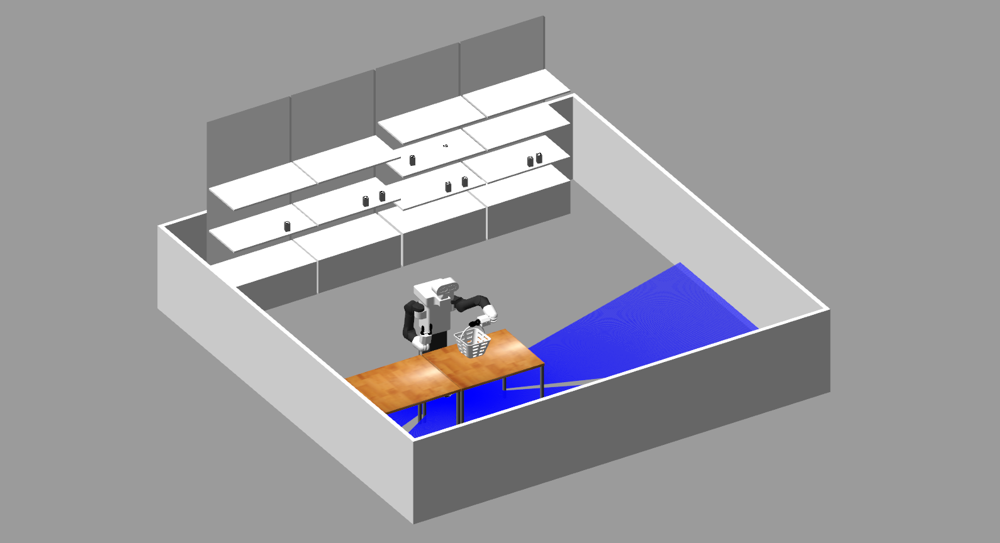

# RO47007: Multidisciplinary Project



## Description

In today's modern society, people are often stressed and always in a hurry, and today's supermarkets only increase this burden. Especially when going to new shops, it is often difficult to locate the product of interest amongst the number of aisles and the plethora of items. Of course, employee's can be asked for help, but they can either never be found when you need them, not know where your product is located if the employee is new, or simply lie about the product being out of stock to not have to search to whole storage room. Supermarkets are simply inefficient, stressful for customers and currently a hotbed for diseases to spread.  

Looking from the supermarkets perspective, decreasing the time people spend in supermarkets will lead to a larger amount of people that can visit the supermarket each day. With the current regulations, where only a limited amount of people is allowed into the supermarket at the same time, a shorter visit will thus lead to a higher revenue of the supermarket.  

Here TIAGo comes into action. TIAGo will stand at a clearly indicated spot and will wait for orders of customers. When a customer is looking for an item, the customer walks to TIAGo and inputs the items via an interface. After confirming the correct item TIAGo will directly tell you if the item is in stock or not. If it is in stock TIAGo will find the product and place it on the desk located in front of TIAGo's initial position. TIAGo will place the order of the customer on the table and will be ready for new tasks.

## Overview

### Folder structure

This project is structured as visualised below. In this tree stucture, plain text indicates a general folder/, links indicate a [package/]() and italic links indicate a [*submodule/*](). Please refer to the links below for a more elaborate explanation of the inner workings of each package.

multidisciplinary_project/  
├─ docs/  
├─ src/  
│  ├─ [custom_msgs](src/custom_msgs/)/  
│  ├─ [detection](src/detection/)/  
│  ├─ motion_control/  
│  │  ├─ [arm_control](src/motion_control/arm_control/)/  
│  │  ├─ [*play_motion_builder*](https://github.com/pal-robotics/play_motion_builder)/  
│  ├─ operator/  
│  │  ├─ [database](src/operator/database/)/  
│  │  ├─ [input_handling](src/operator/input_handling/)/  
│  ├─ planning/  
│  │  ├─ [bt_action_planning](src/planning/bt_action_planning/)/  
│  │  ├─ [*ROS-Behavior-Tree*](https://github.com/miccol/ROS-Behavior-Tree)/  
│  ├─ [*simulation*](https://gitlab.tudelft.nl/cor/ro47007/2021/team-19/retail_store_simulation)/  

### Packages

This repository contains both custom and open-source packages that are used for the following purposes:

- [custom_msgs:](src/custom_msgs/) contains the custom .srv and .action files which will be used by the other packages.
- [detection:](src/detection/) used for detecting aruco markers.
- [arm_control:](src/motion_control/arm_control/) contains action servers to control TIAGo's arm to pick and place objects.
- [*play_motion_builder*:](https://github.com/pal-robotics/play_motion_builder) allows to create custom play_motions.
- [database:](src/database/) contains the predefined database pararmeters and service to check and update the product database.
- [input_handling:](src/operator/input_handling/) contains service requests for user input.
- [bt_action_planning:](src/planning/bt_action_planning/) contains the action behavior of TIAGo. The used approach for this a behavior tree.
- [*ROS-Behavior-Tree*:](https://github.com/miccol/ROS-Behavior-Tree) behavior tree library for ROS.
- [*simulation*:](https://gitlab.tudelft.nl/cor/ro47007/2021/team-19/retail_store_simulation) the retail store simulation environment.

### Architecture

In the figure below, a complete overview of the used software architecture is provided.


## Installation

### Prerequisites

Please refer to [the official TIAGo tutorials]([http://wiki.ros.org/Robots/TIAGo/Tutorials/Installation/TiagoSimulation) for a complete description of the installation requirements. For this project, it is recommended to use the Singularity image provided in the course RO47007: Multidisciplinary Project, which already includes all necessary requirements.

### Install

To clone the repository and all submodules correctly, make sure to run **all** commands in the block below:

```bash
git clone https://gitlab.tudelft.nl/cor/ro47007/2021/team-19/multidisciplinary_project.git
cd multidisciplinary_project
git submodule sync
git submodule update --init --recursive
```

### Local installation

Install all dependecies in the workspace using the following command, or install them in your system's root. If you are using the Singularity image, **the following steps can be skipped**.

```bash
rosinstall src /opt/ros/melodic .rosinstall
```

Setup rosdep:

```bash
sudo rosdep init
rosdep update
```

Run the following command to make sure that all dependencies referenced in the workspace are installed:

```bash
rosdep install --from-paths src --ignore-src -y --rosdistro melodic --skip-keys="opencv2 opencv2-nonfree pal_laser_filters speed_limit_node sensor_to_cloud hokuyo_node libdw-dev python-graphitesend-pip python-statsd pal_filters pal_vo_server pal_usb_utils pal_pcl pal_pcl_points_throttle_and_filter pal_karto pal_local_joint_control camera_calibration_files pal_startup_msgs pal-orbbec-openni2 dummy_actuators_manager pal_local_planner gravity_compensation_controller current_limit_controller dynamic_footprint dynamixel_cpp tf_lookup opencv3"
```

## Build

After installation, run the following command in the main folder to build the workspace:

```bash
source /opt/ros/melodic/setup.bash
catkin build
```

## Usage

In the main folder, run the following commands in seperate terminals to start the simulation environment and action behaviour. Make sure to source each terminal properly using:

```bash
source devel/setup.bash
```

Start the simulation environment in the first terminal using:

```bash
roslaunch simulation simulation.launch 
```

In the second terminal, run the following to start all necessary nodes and parameters:

```bash
roslaunch bt_action_planning setup.launch
```

In the last terminal, run the following to start the behaviour tree:

```bash
rosrun bt_action_planning control_tree
```

After all processes have been launched properly, go to the second terminal and type in the products TIAGo has to retrieve. More instruction will be given in the terminal.
