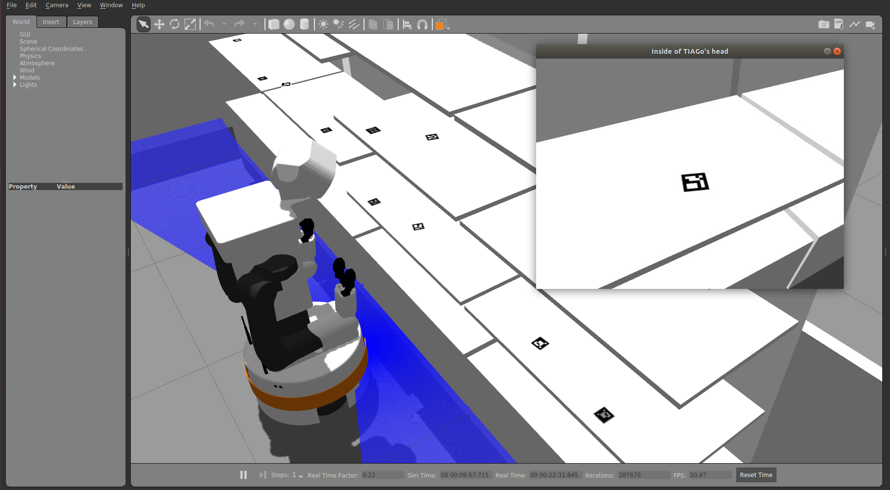
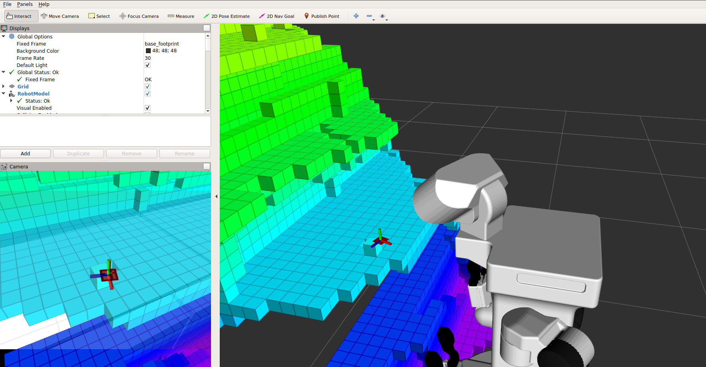

Detection package
==================

## Overview

This package contains the code for detecting Aruco Markers.


**Keywords:** Aruco Marker, Pose, Aruco Cube.


## Usage

The entire simulation and the aruco marker detection can be launched running the following commands in three seperate terminals:

## Step 1: Launch necessary nodes

In the first terminal we will run the simlation:
```
$ roslaunch simulation simulation.launch
```

Next in the second terminal to launch the necessary nodes and parameters run:
```
$ roslaunch detection detection.launch
```
## Step 2: Navigate to Aruco Cube

The detection node is configured to identify the aruco marker with id 333. To change this, edit the marker id parameter to the desired value in the file detection.launch inside the launch folder.
To detect aruco cube with id 333, navigate to the respective aruco cube. Note! Ensure that TIAGo is very close to the table, otherwise the detection wont show up on RViz.

## Step 3: Look at Aruco Cube

To direct the head towards looking at the aruco cube, run the following command in a seperate terminal:

```
$ rosrun look_to_point look_to_point
```

The head directs itself to the pixel selected on the pop-up camera feed. Direct the head towards the aruco cube. After all the steps are completed, you Rviz should display the pose of the aruco cube like shown below:




The pose of the aruco cube is published to the topic /aruco_single/pose. To get the pose, type this command on the terminal:

```
$ rostopic echo /aruco_single/pose
```

## Launch files

* **detection.launch:** this launch file launches the aruco_single node, the necessary parameters and the RViz with the octomap.

## Nodes

The package contains multiple c++ files. The important files are under the src folder, which are explained below:

* **simple_single.cpp:** This node detects a single aruco marker, whose id is specified as a parameter in the detection.launch file.
* **marker_publish.cpp:** This node detects a multiple aruco markers irrespective of their id's. The pose of the detected aruco markers are published to the topic /aruco_marker_publisher/markers.
 The list of detected markers are published to the topic /aruco_marker_publisher/markers_list. 


