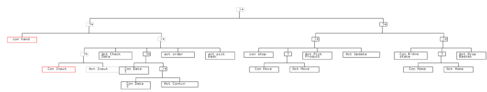

# bt_action_planning

## Overview

In this package the Behavior Tree is programmed, which is used to control the behavior of TIAGo.
There are multiple action and conditions nodes, they all depend on the [ROS-Behavior-Tree](https://github.com/miccol/ROS-Behavior-Tree) package. This repository also includes a [manual](https://github.com/miccol/ROS-Behavior-Tree/blob/master/BTUserManual.pdf) which explain how Behavior Trees work.

The structure of the created Behavior Tree is as following:



**Keywords:** Behavior Tree, actions, conditions

## Usage

The entire simulation and the behavior can be launched running the following commands in three separate terminals:

In the first terminal we will run the simlation:
```
roslaunch simulation simulation.launch
```

Next in the second terminal to launch the necessary nodes and parameters run:
```
roslaunch bt_action_planning setup.launch
```

In the last terminal to run the behavior tree the next command should be executed. Note! Only run this command after the simulation has fully started up, otherwise it won't work properly:
```
rosrun bt_action_planning control_tree
```

Now after the behavior tree is running go to the second terminal and type in the products TIAGo has to retrieve.
More instruction will be given in the terminal.


## Launch files

* **control_bt.launch:** this launch file launches the necessary parameters and nodes.

## Nodes

The src folder contains multiple c++ files. The important information about them is as following:

* **control_tree.cpp:** this is the main Behavior Tree node, by running this the Behavior Tree widget pops up and the behavior is executed
      The node can be executed using:
```
rosrun bt_action_planning control_tree
```  

* **actions folder:** This folder contains the different actions to be executed by the behavior tree and eventually TIAGo. The names of the files indicate the action which it will execute. Note! Try not to run these action separately, this will not work as there are programmed to wait till they are executed by the main Behavior Tree nodes
   * **action_check_database:** Creates a list if all the requested products are available
      * Returns Success: If the Two parameters shopping_list_available, shopping_list_in order containing the shopping list are created.
      * Returns Failure: If something went wrong
   * **action_continue_request:**  When not all of the items are available but one/some of them are a continue request message will be sent to the terminal.
      * Returns Success: If the user wishes to continue
      * Returns Failure: If the user wishes not to continue
   * **action_drop_basket:** Used to drop the basket
      * Returns Success: If the basket was successfully dropped
      * Returns Failure: If the basket dropping was not done successfully
   * **action_input_request:** Used to make an input request, a shopping list will be created with the products which are typed into the terminal
      * Returns Success: If the Parameter shopping list with all the items is created.
      * Returns Failure: if something went wrong
   * **action_move_base:** Moves the base to the next product from the shopping lists
      * Returns Success: If the base has moved to the correct location.
      * Returns Failure: If the base has not reached its correct location.
   * **action_pick:** used to detect, pick up the product and drop it in the basket, while standing in front of the product.
      * Returns Success: If TIAGo has detected, picked up the product, dropped in the basket and tucked its arm.
      * Returns Failure: If TIAGo has executed all necessary actions.
   * **action_return_to_home:** Moves TIAGo to its home position.
      * Returns Success: If the home is reached.
      * Returns Failure: If the home is not reached.
   * **action_update_next_product:** After a product has been picked a new list will be made without the picked product. At the same time the database will be updated to remove the picked product from the database
      * Returns Success: If a new list is created which is smaller than the old one and the product is removed from the database.  
      * Returns Failure: If this list is not created, or the product is not removed from the database
   * **action_update_order:** This action will update the order of the products, such that the fastest path is obtained.
      * Returns Success: If server request to update the order of the products, has returned successful.
      * Returns Failure: If server request returns as failure.


* **conditions folder:** This folder contains multiple conditions which are set in the Behavior Tree, based on these conditions it will be decided if the behavior can be continued or if an earlier part of the tree has to be executed first. Again the names condition names indicate their condition. Note! Try not to run these conditions separately, this will not work as there are programmed to wait till they are executed by the main Behavior Tree nodes
   * **condition_database1:** Used to check whether the requested list of products is the same size as the available products.
      * Returns True: If size is equal to each other
      * Returns False: If size is not equal to each other
   * **condition_database2:** Used to check if the list of available products is bigger or equal to 1.
      * Returns True: If the available list is bigger or equal to 1.
      * Returns False: If the available list is smaller than 1.
   * **condition_handling_request:** Checks if there is a shopping request currently running.
     * Returns True: If there is a shopping request running, meaning the parameter /handling_request is true.
     * Returns False: If there is no shopping request running.
   * **condition_input_request:** Checks if the input list of requested products is bigger than 0.
      * Returns True: If the input list is bigger than 0.
      * Returns False: If the input list is 0 or smaller.
   * **condition_move_base:** Used to check if TIAGo is at the goal position.
      * Returns True: If TIAGo is at the correct position (a small deflection is allowed).
      * Returns False: If TIAGo is not at the correct position.
   * **condition_return_to_home:** check if TIAGo is at the home position.
      * Returns True: If TIAGo is at the home position (a small deflection is allowed).
      * Returns False: If TIAGo is not at the home position.
   * **condition_right_arm_state:** Checks if the arm has just dropped a product in the basket.
      * Returns True: If the parameter /hold/right_arm is true.
      * Returns False: If the parameter /hold/right_arm is false.
  * **condition_shoppinglist:** Checks if there are next products to be picked.
     * Returns True: If the size of the parameter /shopping_list_in_order is bigger than 1.
     * Returns False: If the parameter /shopping_list_in_order is empty.

## include
The include folder contain three types of files:
* **bt.h:** This can be included by **control_tree.cpp** file in order to use all nodes as described above.
* **actions:** .h files of the action nodes. They will be included in both the **control_tree.cpp** file (trough the bt.h file) and the separate action.cpp files.
* **conditions:** .h files of the condition nodes. They will be included in both the **control_tree.cpp** file (trough the bt.h file) and the separate condition.cpp files.
